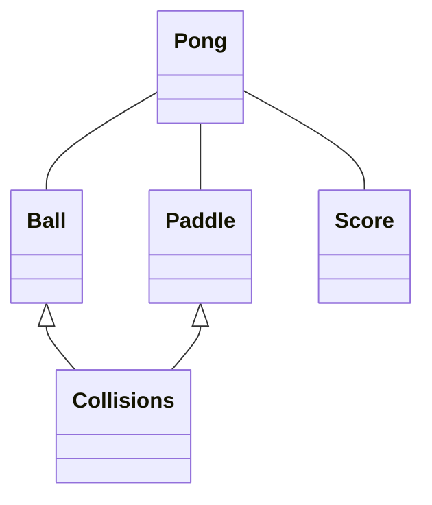
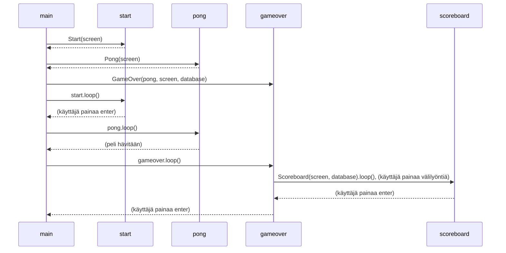

#### Pong sovelluslogiikan luokkakaavio :

#### Pelin eri näkymien kulku / main-funktio sekvenssikaaviona:

Kaavio kuvaa main-funktion eri näkymiä vaihtelevaa silmukkaa. Kaaviossa esitetty silmukka alkaa viimeisen kohdan jälkeen alusta ja jatkuu, kunnes käyttäjä sulkee ohjelman.  
