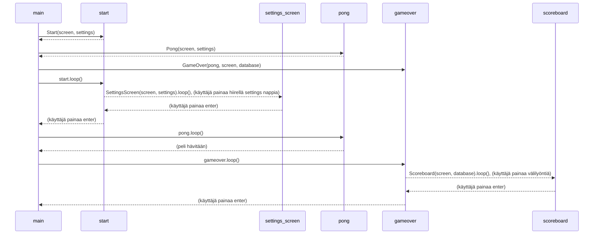
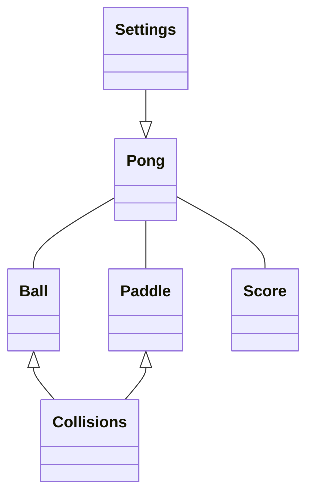
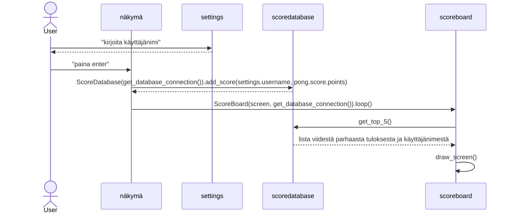

# Arkkitehtuurikuvaus
## Kansioiden rakenne
**ui** : sisältää käyttöliittymään liittyvän koodin

**entities** : sisältää objekteista vastaavan koodin ja pong-luokan, joka vastaa pelilogiikasta ja pelinäkymän käyttöliittymästä

**repositories** : sisätää tiedon tallennukseen liittyvän koodin

## Käyttöliittymä
Käyttöliittymän eri näkymät:
* Aloitus
* Asetukset
* Pelaus
* Lopetus
* Tulostaulu
Jokainen näistä on toteutettu omana luokkanaan. Pelausnäytön käyttöliittymää en saanut erotettua pelilogiikasta, joten siitä vastaava Pong-luokka sijaitsee entities kansiossa. Muut käyttöliittymän luokat sijaitsevat ui-kansiossa.
Index.py tiedostossa sijaitseva main-funktio vastaa siitä, mikä päänäkymistä (aloitus, pelaus, lopetus) näkyy milloinkin. Asetukset näkymään pääsee aloitusnäkymästä vastaavasta luokasta ja tulostaulu näkymään pääsee lopetusnäkymästä vastaavasta luokasta.

### Pelin eri näkymien kulku / main-funktio sekvenssikaaviona:

Kaavio kuvaa main-funktion eri näkymiä vaihtelevaa silmukkaa. Kaaviossa esitetty silmukka alkaa viimeisen kohdan jälkeen alusta ja jatkuu, kunnes käyttäjä sulkee ohjelman.  

### Pong pelilogiikan luokkakaavio :

## Tulosten tallennus
Kansio repositories luokka ScoreDatabase vastaa tulosten tallentamisesta. ScoreDatabase-luokan funktio *add_socre* tallentaa tietoa SQLite-tietokantaan, jonka tiedostonimi on highscores.db.
Tietokannassa on yksi taulu, joka sisältää sarakkeet käyttääjänimelle ja saadulle tulokselle.
ScoreDatabase-luokassa on funktio *get_top_5*, joka palauttaa listana viisi parasta tulosta järjestyksessä parhaasta huonoimpaan. Tätä funktiota käytetään tulostaulun käyttöliittymästä vastaavassa ScoreBoard-luokassa.

Pääkansiossa on empty_database.py tiedosto, jonka ajamalla tietokanta voidaan tyhjentää.

#### Tulosten tallennus ja haku sekvenssikaaviona
Kun peli on aloitusnäkymässä, etenee tietojen tallennus seuraavasti:

Kaaviossa havainnoidaan vain tietojen tallennkusen kulkua, joten siinä ei oteta kantaa siihen millä päänäkymällä ollaan milläkin hetkellä.

